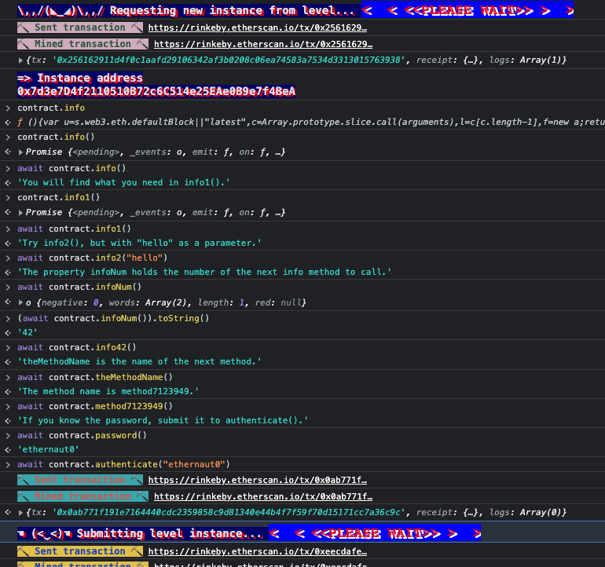
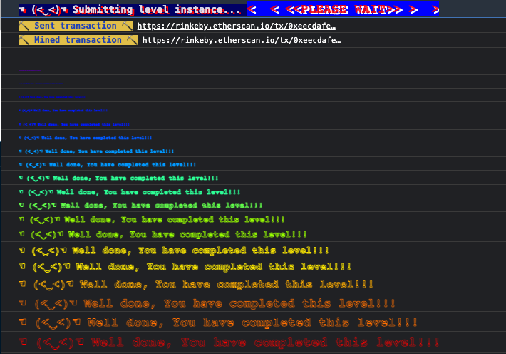
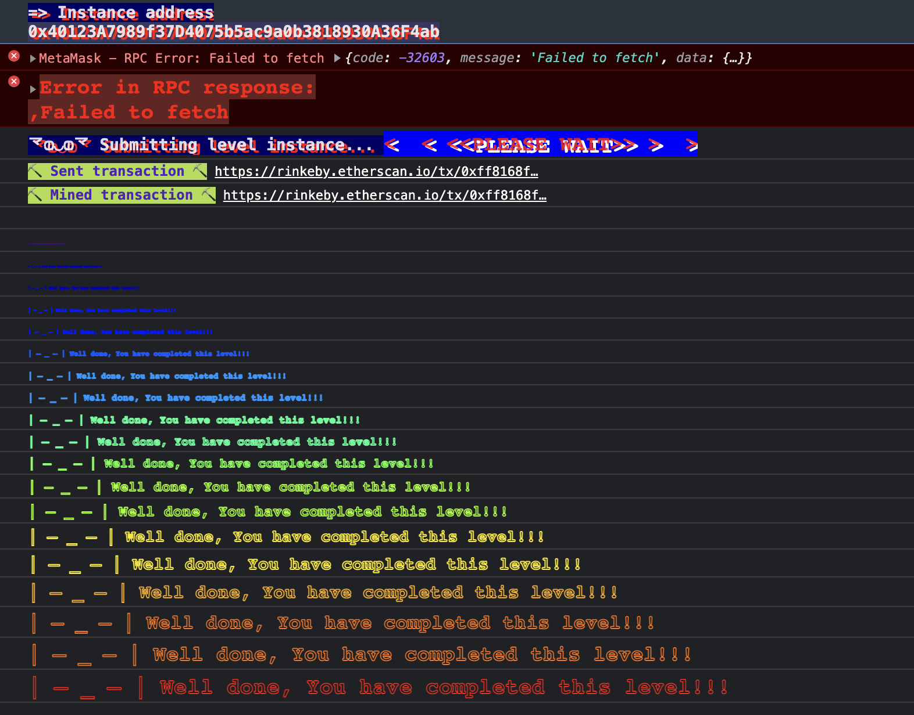

# Level 0: Hello Ethernaut

## Info

This level contains instruction on how to setup and connect via metamask on the Rinkeby network. Some helpful commands were also introduced;

- `player`: displays the player's address.
- `getBalance(addr)`: displays ether balance in addr.
- `help`: displays in-game help menu
- `ethernaut`: game's main smart-contract
- `ethernaut.owner()`: queries and returns owner of ethernaut game.
- `contract`: level's contract ABI
- `contract.info()`: get level's info

To complete this level:

- Click "Get new instance" button to get a new instance
- `await contact.info()` and follow prompts

- click on the "Submit instance" button after signing the `.authenticate` transaction

- On completion, it shows the level's contract source code

```solidity
// SPDX-License-Identifier: MIT
pragma solidity ^0.6.0;

contract Instance {

  string public password;
  uint8 public infoNum = 42;
  string public theMethodName = 'The method name is method7123949.';
  bool private cleared = false;

  // constructor
  constructor(string memory _password) public {
    password = _password;
  }

  function info() public pure returns (string memory) {
    return 'You will find what you need in info1().';
  }

  function info1() public pure returns (string memory) {
    return 'Try info2(), but with "hello" as a parameter.';
  }

  function info2(string memory param) public pure returns (string memory) {
    if(keccak256(abi.encodePacked(param)) == keccak256(abi.encodePacked('hello'))) {
      return 'The property infoNum holds the number of the next info method to call.';
    }
    return 'Wrong parameter.';
  }

  function info42() public pure returns (string memory) {
    return 'theMethodName is the name of the next method.';
  }

  function method7123949() public pure returns (string memory) {
    return 'If you know the password, submit it to authenticate().';
  }

  function authenticate(string memory passkey) public {
    if(keccak256(abi.encodePacked(passkey)) == keccak256(abi.encodePacked(password))) {
      cleared = true;
    }
  }

  function getCleared() public view returns (bool) {
    return cleared;
  }
}
```

## Review 🕵️🕵️‍♀️🕵️‍♂️

After having the source code for this level, I can say the technical objective of this level is to 

> "set the `cleared` state variable to `true`".

And the only obvious way to do that is to pass through the `authenticate` function, which require us to know the `passkey`. The `passkey` is equivalent to the `password` state variable. The password is a public state variable and can be read directly via contract interaction.

### Test 
To try this out, I'll request for a new instance and write the POC in solidity. 🤞🤞🤞🤞🤞

```solidity
// SPDX-License-Identifier: MIT
pragma solidity ^0.6.0;

import "forge-std/Test.sol";
import "@level0/instance.sol";

contract POC is Test{
    Instance instance = Instance(0x40123A7989f37D4075b5ac9a0b3818930A36F4ab);

    function testHack() public returns(bool){
        assertFalse(instance.getCleared());
        instance.authenticate(instance.password());
        assertTrue(instance.getCleared());
    }
}
```

#### Test output

```shell
> forge test -vvv --fork-url $RPC_URL
[⠑] Compiling...
No files changed, compilation skipped

Running 1 test for test/level0/poc.sol:POC
[PASS] testHack():(bool) (gas: 35290)
Test result: ok. 1 passed; 0 failed; finished in 5.58s
```

Our test works now. Let's migrate this to a script so that the data would be persisted on the blockchain, then we can click the "Submit instance" on the ethernaut page.

### Script

The script is similar to the test file;

```solidity
// SPDX-License-Identifier: MIT
pragma solidity ^0.6.0;

import "forge-std/Script.sol";
import "@level0/instance.sol";

contract POC is Script {
    Instance instance = Instance(0x40123A7989f37D4075b5ac9a0b3818930A36F4ab);

    function run() external {
        vm.startBroadcast();
        
        require(!instance.getCleared(), "Level completed already");
        instance.authenticate(instance.password());
        require(instance.getCleared(), "failed to complete level");

        vm.stopBroadcast();
    }
}
```

#### Script output

Hurray! It was a success!!! Here are the logs

```shell
> forge script ./script/level0/poc.s.sol:POC --rpc-url $RPC_URL  --private-key $PRIVATE_KEY --broadcast -vvvv

[⠒] Compiling...
[⠆] Compiling 1 files with 0.6.12
[⠰] Solc 0.6.12 finished in 614.02ms
Compiler run successful
Traces:
  [38375] POC::run() 
    ├─ [0] VM::startBroadcast() 
    │   └─ ← ()
    ├─ [2450] 0x4012…f4ab::3c848d78() [staticcall]
    │   └─ ← 0x0000000000000000000000000000000000000000000000000000000000000000
    ├─ [3152] 0x4012…f4ab::224b610b() [staticcall]
    │   └─ ← 0x0000000000000000000000000000000000000000000000000000000000000020000000000000000000000000000000000000000000000000000000000000000a65746865726e6175743000000000000000000000000000000000000000000000
    ├─ [21513] 0x4012…f4ab::aa613b29(0000000000000000000000000000000000000000000000000000000000000020000000000000000000000000000000000000000000000000000000000000000a65746865726e6175743000000000000000000000000000000000000000000000) 
    │   └─ ← ()
    ├─ [450] 0x4012…f4ab::3c848d78() [staticcall]
    │   └─ ← 0x0000000000000000000000000000000000000000000000000000000000000001
    ├─ [0] VM::stopBroadcast() 
    │   └─ ← ()
    └─ ← ()


Script ran successfully.
Gas used: 38375
==========================
Simulated On-chain Traces:

  [47105] 0x4012…f4ab::aa613b29(0000000000000000000000000000000000000000000000000000000000000020000000000000000000000000000000000000000000000000000000000000000a65746865726e6175743000000000000000000000000000000000000000000000) 
    └─ ← ()


==========================

Estimated total gas used for script: 47105
==========================

###
Finding wallets for all the necessary addresses...
##
Sending transactions [0 - 0].
⠁ [00:00:00] [#########################################################################################################################################] 1/1 txes (0.0s)
Transactions saved to: broadcast/poc.s.sol/4/run-latest.json

##
Waiting for receipts.
⠉ [00:00:18] [#####################################################################################################################################] 1/1 receipts (0.0s)
#####
✅ Hash: 0xa195faa5dd6cf7ca68e8e25c51396256b8c2877521737e40247c27eb62ded2e7
Block: 11001556
Paid: 0.000141315000423945 ETH (47105 gas * 3.000000009 gwei)


Transactions saved to: broadcast/poc.s.sol/4/run-latest.json


==========================

ONCHAIN EXECUTION COMPLETE & SUCCESSFUL. Transaction receipts written to "broadcast/poc.s.sol/4/run-latest.json"

Transactions saved to: broadcast/poc.s.sol/4/run-latest.json
```

Clicking on the "Submit instance"  button after that:



Cheers! 🏆🏆🏆🏆
Let's have some fun!!
Onto the next one!
# 🚴
