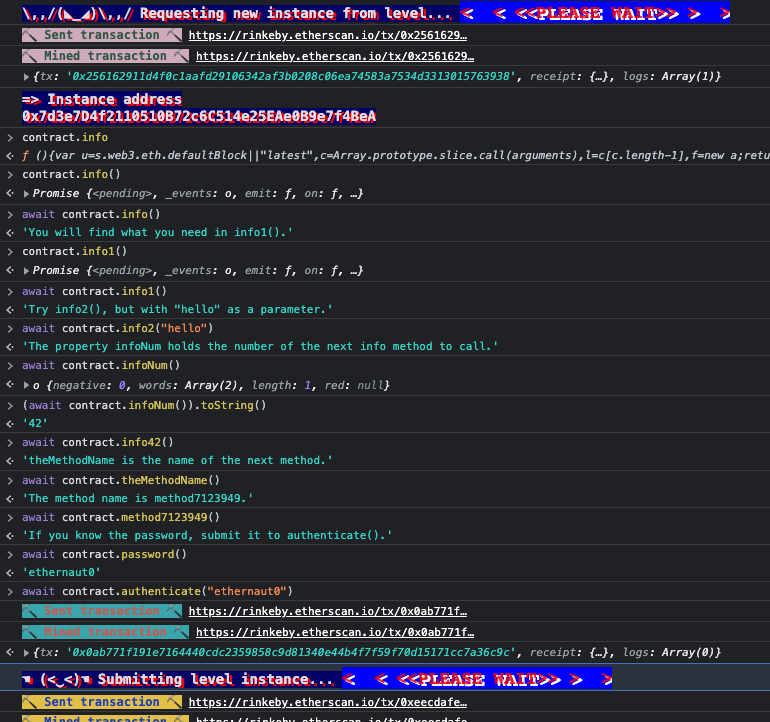
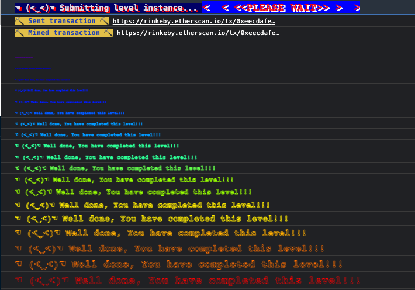

# Level 0: Hello Ethernaut

## Info

This level contains instruction on how to setup and connect via metamask on the Rinkeby network. Some helpful commands were also introduced;

- `player`: displays the player's address.
- `getBalance(addr)`: displays ether balance in addr.
- `help`: displays in-game help menu
- `ethernaut`: game's main smart-contract
- `ethernaut.owner()`: queries and returns owner of ethernaut game.
- `contract`: level's contract ABI
- `contract.info()`: get level's info

To complete this level:

- Click "Get new instance" button to get a new instance
- `await contact.info()` and follow prompts

- click on "Submit instance" button after signing the `.authenticate` transaction

- On completion, it shows the level's contract source code

```solidity
// SPDX-License-Identifier: MIT
pragma solidity ^0.6.0;

contract Instance {

  string public password;
  uint8 public infoNum = 42;
  string public theMethodName = 'The method name is method7123949.';
  bool private cleared = false;

  // constructor
  constructor(string memory _password) public {
    password = _password;
  }

  function info() public pure returns (string memory) {
    return 'You will find what you need in info1().';
  }

  function info1() public pure returns (string memory) {
    return 'Try info2(), but with "hello" as a parameter.';
  }

  function info2(string memory param) public pure returns (string memory) {
    if(keccak256(abi.encodePacked(param)) == keccak256(abi.encodePacked('hello'))) {
      return 'The property infoNum holds the number of the next info method to call.';
    }
    return 'Wrong parameter.';
  }

  function info42() public pure returns (string memory) {
    return 'theMethodName is the name of the next method.';
  }

  function method7123949() public pure returns (string memory) {
    return 'If you know the password, submit it to authenticate().';
  }

  function authenticate(string memory passkey) public {
    if(keccak256(abi.encodePacked(passkey)) == keccak256(abi.encodePacked(password))) {
      cleared = true;
    }
  }

  function getCleared() public view returns (bool) {
    return cleared;
  }
}
```

## Review

After having the source code for this level, I can say the technical objective of this level is to 

> "set the `cleared` state variable to `true`".

And the only obvious way to do that is to pass through the `authenticate` function, which require us to know the `passkey` which is equivalent to the `password` state variable. The password is a public state variable and can be read directly via ABI interaction.

To try this out, I'll request for a new instance. :finger-crossed

```solidity
function authenticate(string memory passkey){
```

Cheers!
Let's have some fun!!
Onto the next one!